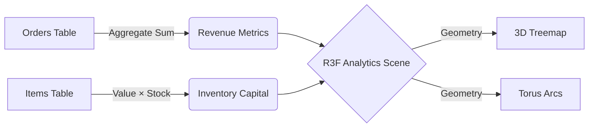

# 📚 VisualOS — API & Data Access Layer

> [!NOTE]  
> **Database Architecture Shift:** VisualOS has been migrated from a local `SQLite/OPFS` architecture to a scalable, real-time **Supabase (PostgreSQL)** backend. The Data Access Layer (DAL) abstracts these remote calls.

## 🔌 Core Concepts

### 1. Data Access Layer (`src/db/dal.ts`)
The `DAL` standardizes all Supabase API calls. Do not invoke `supabase.from()` directly in UI components; always route through the DAL for consistent error handling and type safety.

```typescript
import { supabase } from '@/db/supabase';
import { DAL } from '@/db/dal';
import { useLiveQuery } from '@/hooks/useLiveQuery';
```

---

## 🏗️ Schema Overview

> [!IMPORTANT]  
> All tables are secured using **Row Level Security (RLS)** in Supabase. The `firm_id` must match the authenticated user's `firm_user.firm_id` to read or write data.

### 📦 Items Table
The central inventory table storing pricing, categorization, and physical location mappings.

| Field | Type | Description |
|-------|------|-------------|
| `id` | `bigint` | Primary Key |
| `item_name` | `text` | e.g., "Apsara Long Notebook" |
| `firm_id` | `uuid` | Foreign Key → `firms` |
| `stock_parcels` | `integer` | Current physical boxes/cartons |
| `retail_price_unit` | `numeric` | Default B2C price |
| `wholesale_price_unit` | `numeric` | Default B2B price |
| `mrp` | `numeric` | Legal maximum price constraint |

#### 🛠️ DAL Usage Example
```typescript
// Fetch items with brand and vertical joins
const items = await DAL.items.getAll();

// Create new item
await DAL.items.add({
  item_name: 'Premium Sparklers',
  stock_parcels: 50,
  retail_price_unit: 14.50
});
```

---

### 🛒 Orders & Transactions

VisualOS maintains strict financial integrity through the `orders` and `order_items` tables.

> [!WARNING]  
> Order generation uses a transaction-like boundary. When an order is moved to `dispatched`, stock levels must be decremented atomically.

| Field | Type | Description |
|-------|------|-------------|
| `prospect_id` | `bigint` | Customer identifier |
| `pricing_mode` | `text` | `retail` \| `wholesale` |
| `status` | `text` | `pending` \| `dispatched` \| `cancelled` |
| `grand_total` | `numeric` | Final calculated invoice total |

---

## 🧠 State Management (`src/store/store.ts`)

> [!TIP]  
> The Zustand store handles ephemeral UI state (cart, theming, routing context) but defers to Supabase Realtime for canonical data truth.

### Billing Context Actions
| Action | Signature | Purpose |
|--------|-----------|---------|
| `addToCart` | `(item) => void` | Appends item, infers price from current `pricingMode` |
| `updateCartItemQty` | `(id, qty) => void` | Modifies line item quantity |
| `setPricingMode` | `(mode) => void` | Instantly recalculates all cart prices based on constraint |

### Firm Context Actions
```typescript
// Sets the global session context, defining RLS boundaries
setUserSession(session, firmId, role, firmName)
```

---

## 📊 Analytics Pipelines

Upcoming analytical views (Heatmaps, P&L arcs) rely on materialized queries to prevent heavy client-side processing.


