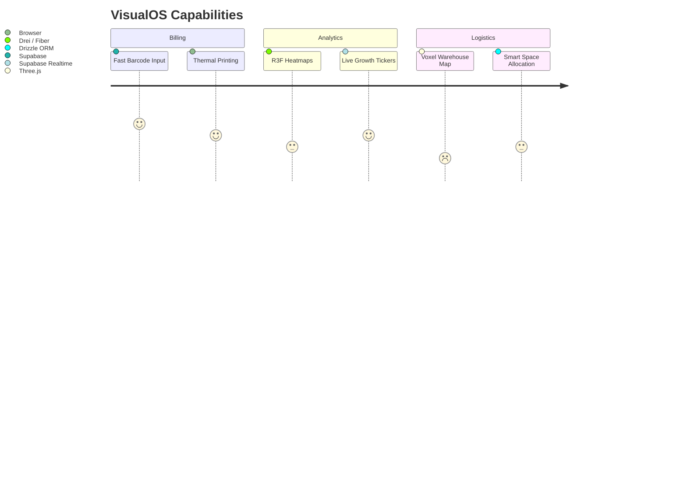

# 🚀 VisualOS — Feature Changelog & Roadmap

> [!IMPORTANT]  
> VisualOS has completed the migration from a local-first SQLite/Dexie architecture to a multi-tenant, cloud-first **Supabase** infrastructure. This unlocks massive SaaS potential while retaining lightning speed.

---

## 🟢 Completed Migrations & Features

### 1. Database Transformation (Supabase + RLS)
- **Multi-Tenant Security:** Wrote the complete `supabase_schema.sql` utilizing Row Level Security (RLS) policies.
- **Isolations:** `firm_users` mapping table ensures users only see `items`, `orders`, and `prospects` belonging to their specific firm.
- **DAL Refactor:** Replaced all `sqlocal` SQLite calls with fully typed Supabase JS client interactions inside `src/db/dal.ts`.

### 2. Print & Report Generation
- Integrated `jspdf` and `jspdf-autotable`.
- Capable of generating robust, multi-page tabular PDF reports directly in the browser.
- **Workaround Resolved:** Excluded `pdfjs-dist` from Vite worker optimization to ensure seamless dev-server uptime.

---

## 🟡 In-Progress Engineering

### 3. R3F Analytics Engine (The Crypto-Style Treemap)
> [!NOTE]  
> Moving away from boring tables to rich WebGL analytics.

- **Objective:** Build extremely dense, visually striking data visualizations using WebGL (`@react-three/fiber`). 
- **The Heatmap:** A hierarchical treemap (Verticals -> Brands -> Items) where geometry area maps to *Total Cost* or *Revenue*, and color grading (Green/Red) maps to *MoM Growth*.
- **The Dashboard:** Includes D3 hierarchy parsing mapped to flat `<mesh>` planes, achieving ultra-high performance even with 10k+ SKU inventories.

### 4. Voxel-Based Warehouse Simulation (Digital Twin)
> [!TIP]  
> **A True Game-Changer:** A 2D/3D visual layout (BIM-lite) of the physical warehouse racks, sections, and floors.

- **Phase 1 (2D MVP):** Top-down CSS Grid map. Cells highlight when an item string is searched.
- **Phase 2 (3D Orbit):** R3F `<BoxGeometry>` extrusions. Height scales dynamically with `parcel_count`. Colors reflect brand identifiers.
- **Core Value:** Replaces manual spreadsheet location lookups with intuitive spatial memory mapping. Massively reduces picker/packer onboarding time.

---

## ⚪ Planned Architectural Decisions

### Data Entry Solutions (Spreadsheet vs CSV)
- We evaluated building a bulk-CSV import system with rigid templates.
- **Pivot:** Instead, we are building `ReactDataGrid` (or an HTML table equivalent) directly into the DB Editor UI. Bulk-editing should feel identical to Excel, but validated in real-time against schema constraints.

### Mobile & Progressive Enhancement
If a device cannot handle the R3F WebGL views cleanly (low-end phones), the application will safely fallback to standard React list-views.

