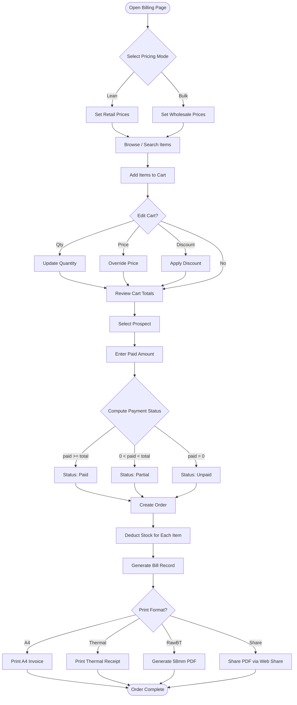
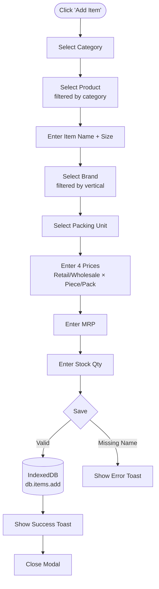
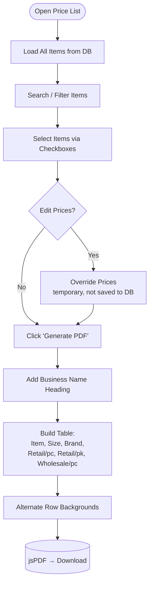
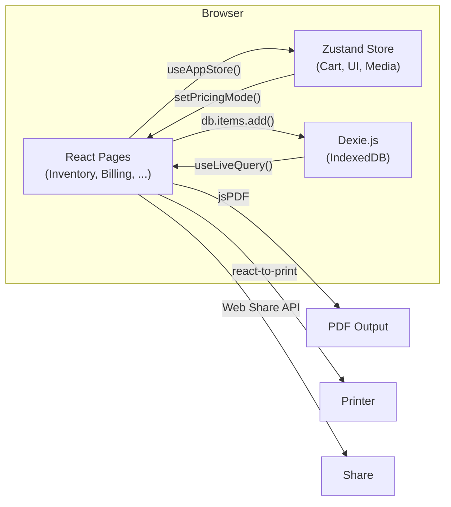

# VisualOS — Workflow Flowcharts

## 1. Billing Workflow

---

## 2. Inventory Item Creation

---

## 3. Price List PDF Generation

---

## 4. Backup & Restore

```mermaid
flowchart TD
    subgraph Export
        E_START([Click Export]) --> E_TABLES[Read All Table Names]
        E_TABLES --> E_DATA[Fetch Data from Each Table]
        E_DATA --> E_MEDIA{Has product_media?}
        E_MEDIA -->|Yes| E_B64[Encode Blobs → Base64]
        E_MEDIA -->|No| E_JSON
        E_B64 --> E_JSON[Build JSON Object]
        E_JSON --> E_DOWNLOAD[Download .json File]
    end

    subgraph Import
        I_START([Click Import]) --> I_FILE[Select .json File]
        I_FILE --> I_PARSE[Parse JSON]
        I_PARSE --> I_VALID{Valid Structure?}
        I_VALID -->|No| I_ERR[Show Error Toast]
        I_VALID -->|Yes| I_CLEAR[Clear All Tables]
        I_CLEAR --> I_RESTORE[BulkAdd Each Table]
        I_RESTORE --> I_MEDIA{Has media?}
        I_MEDIA -->|Yes| I_BLOB[Decode Base64 → Blobs]
        I_MEDIA -->|No| I_DONE
        I_BLOB --> I_DONE[Show Success Toast]
    end
```

---

## 5. Application Data Flow

