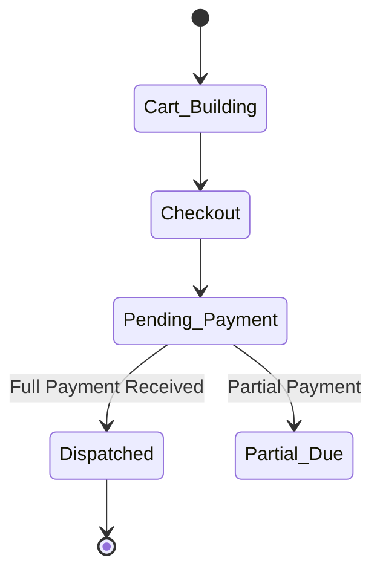

# 🎯 VisualOS — Functional Specification

> [!NOTE]  
> VisualOS is a multi-tenant, cloud-synced SaaS application designed for wholesale and retail inventory management, CRM, and spatial warehouse logistics.

---

## 🗺️ Navigation & Modules

| Module | Core Purpose |
|------|---------|
| **Dashboard** | At-a-glance KPIs — item count, dynamic low stock alerts, recent transactions. |
| **Inventory** | Master SKU matrix. Manage items across multiple hierarchical layers (Vertical → Brand → Product). |
| **Billing (POS)** | Point of Sale interface. Switch between `Bulk` (Wholesale) and `Lean` (Retail) pricing instantly. |
| **Warehouse (Voxel)** | spatial 2D/3D representation of physical racks, bins, and parcels for visual picking/packing. |
| **Analytics (Treemap)** | Hierarchical WebGL treemaps depicting nested revenue and cost geometry visually. |
| **Prospects CRM** | Client directory mapped to geographical areas and business types. |
| **Price Lists** | Generate heavily branded, tabular PDF catalogs directly in the browser. |

---

## ✨ Core Feature Nuances

### 📦 1. 3-Tier Volumetric Stock
VisualOS abandons simple "quantity" integers for a realistic volumetric model:
1. **P_unit:** The atomic unit (e.g., 1 Pencil).
2. **P_unit_per_parcel:** The box scale (e.g., 50 Pencils per Box).
3. **Stock Parcels:** Physical boxes in the warehouse.

*When a sale is made, the engine calculates the atomic deduction and correctly reduces physical parcel counts.*

### 🏢 2. Multi-Tenant Firm Isolation
Unlike single-database apps, VisualOS is designed for Franchises. 
- A single user account can access **Firm A (Master)** and **Firm B (Retail Branch)**.
- Supabase **Row Level Security (RLS)** guarantees that when logged into Firm B, it is mathematically impossible to query Firm A's inventory or sales data.

### 🎨 3. Fallback Rendering (WebGL → DOM)
High-end desktop users get beautiful `@react-three/fiber` 3D visualizations for Analytics and Warehouse management. If accessed on a low-end mobile device, the system gracefully degrades to CSS-Grid or DOM-based lists to preserve battery and maintain 60FPS.

---

## 💳 Billing Lifecycle

- **Cart Building:** Sales reps scan or search items, adjusting quantities.
- **Dynamic Pricing:** Prices auto-shift based on the prospect's tier (Retail vs Wholesale).
- **Dispatch:** Only when an order hits the `dispatched` state does the strict stock mutation trigger.
