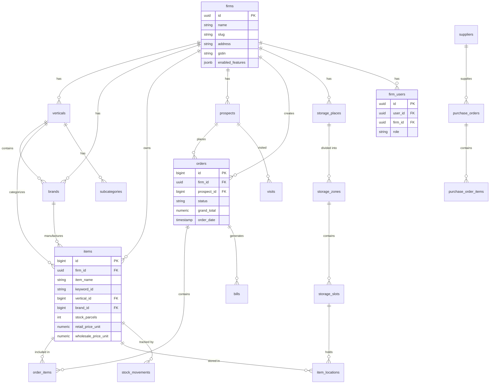
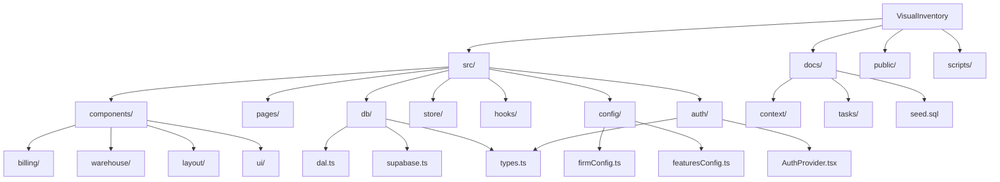
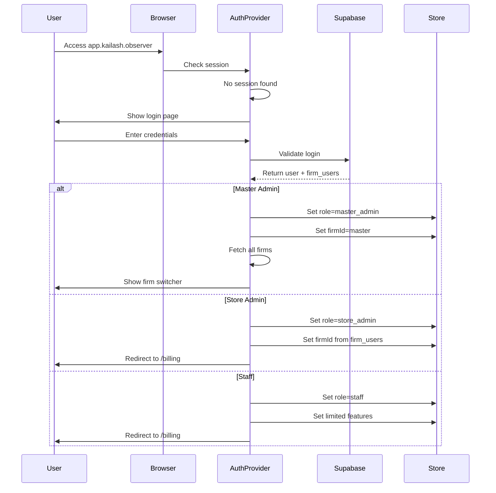
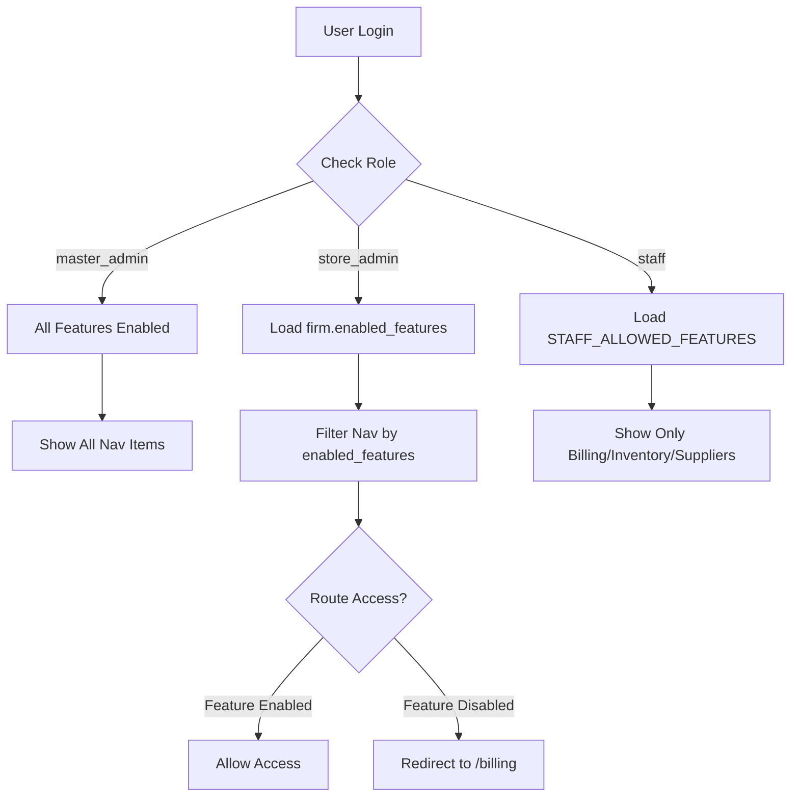
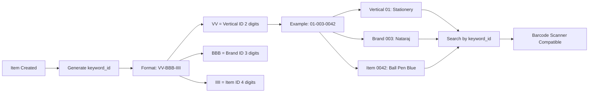
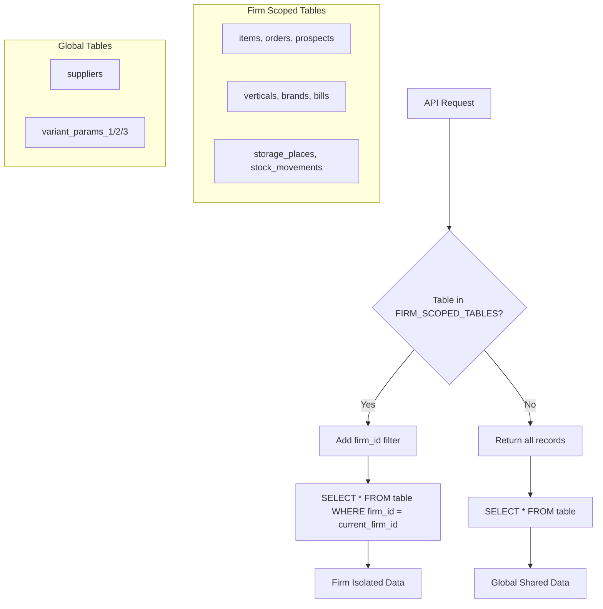

# VisualInventory Architecture Documentation

## Database Schema

## Folder Structure

## Firm-Based Auth Flow (Subdomain)

## Feature Flag System

## SKU/Keyword Logic

## Data Isolation (Firm Scope)

---

## Quick Reference

### Firm UUIDs
| Firm | UUID | Subdomain |
|------|------|-----------|
| Master HQ | `11111111-1111-1111-1111-111111111111` | `app.kailash.observer` |
| R.S. Enterprises | `33b0fa7a-217c-4c85-982e-e5301906bda7` | `rs.kailash.observer` |
| Kailash Fataka | `a41012cc-d643-41ea-a0f4-7bb5c1f08a51` | `kailash.kailash.observer` |
| Kartik Traders | `be17178e-4f92-4392-83de-1bfccdae1ff3` | `kartik.kailash.observer` |

### Default Credentials
| Username | Password | Role | Firm Access |
|----------|----------|------|-------------|
| admin | visualos2024 | master_admin | All firms |
| rs_admin | rs2024 | store_admin | R.S. Enterprises |
| kailash_admin | kailash2024 | store_admin | Kailash Fataka |
| kartik_admin | kartik2024 | store_admin | Kartik Traders |
| staff | staff2024 | staff | R.S. Enterprises |

### Role Permissions
| Feature | master_admin | store_admin | staff |
|---------|-------------|-------------|-------|
| Admin Panel | ✅ | ❌ | ❌ |
| All Firms | ✅ | ❌ | ❌ |
| Feature Toggle | ✅ | ❌ | ❌ |
| Analytics | ✅ | ✅ | ❌ |
| Reports | ✅ | ✅ | ❌ |
| Billing | ✅ | ✅ | ✅ |
| Inventory | ✅ | ✅ | ✅ |
| Suppliers | ✅ | ✅ | ✅ |
| Warehouse | ✅ | ✅ | ✅ |
