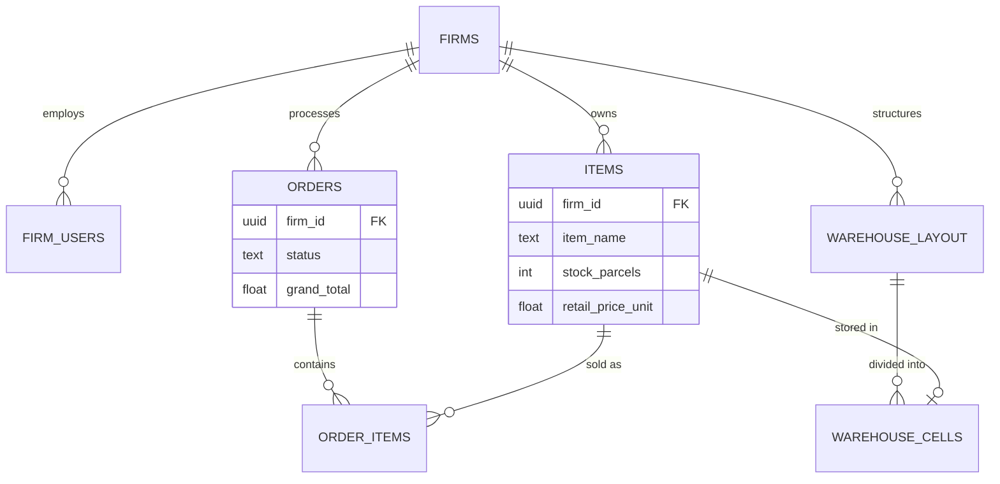
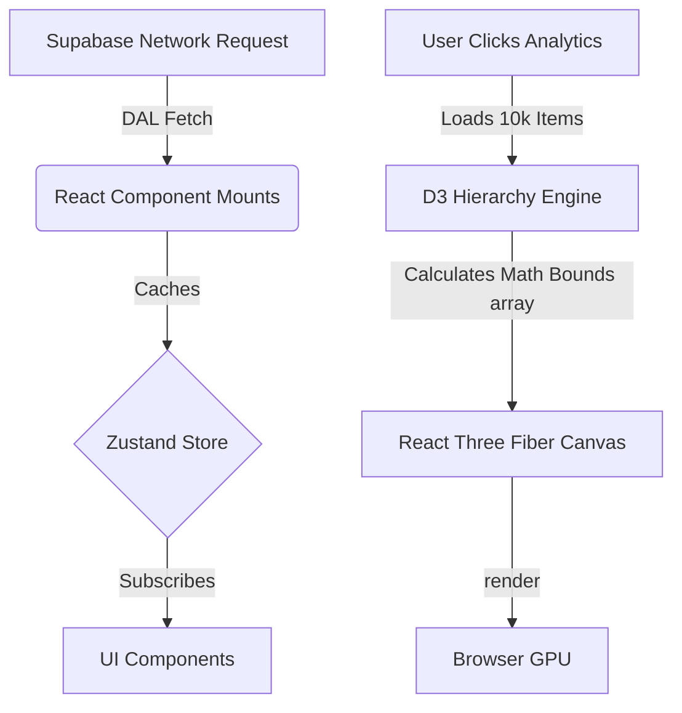

# ⚙️ VisualOS — Technical Architecture

> [!IMPORTANT]  
> VisualOS is built on a modern **Vite + React 18 + Supabase** stack. It leverages cutting-edge browser technologies (WebGL, Web Workers) while maintaining a strict, secure relational database backend.

---

## 🧱 Technology Stack

| Domain | Technology | Purpose |
|-------|-----------|---------|
| **Core** | `React 18` + `TypeScript` | Strongly typed UI logic |
| **Build** | `Vite` | Lightning fast HMR & optimized bundling |
| **Backend** | `Supabase` (PostgreSQL) | Auth, Database, and Realtime sync |
| **State** | `Zustand` | Atomic, cross-component UI/Cart state |
| **Graphics** | `Three.js` + `@react-three/fiber` | Voxel warehouse and analytical treemaps |
| **Math** | `d3-hierarchy` | Calculating spatial bounds for heatmaps |
| **PDF** | `jspdf` | Client-side catalog and invoice generation |

---

## 🗄️ Database Architecture (PostgreSQL)

The entire application relies on Supabase **Row Level Security (RLS)**. Every table has a `firm_id` column ensuring strict multi-tenant boundaries.

---

## 🏎️ State & Rendering Pipeline

To handle thousands of inventory items without browser lag, VisualOS avoids heavy generic table libraries. 

### 🧠 Core Design Tenets
1. **Client-Side Heavy, Server-Side Dumb:** Supabase acts exclusively as a secure data-store. All PDF generation, CSV parsing, math aggregations, and visual calculations happen on the user's local CPU/GPU saving massive server costs.
2. **Immutable React State:** Zustand is used to prevent prop-drilling, but database data is fetched fresh via the DAL to ensure the PWA doesn't desync from truth.
3. **React 18 Strict Compatibility:** 3rd party rendering libraries (like `@react-three/drei`) are strictly version-locked to guarantee Reconciler stability.
