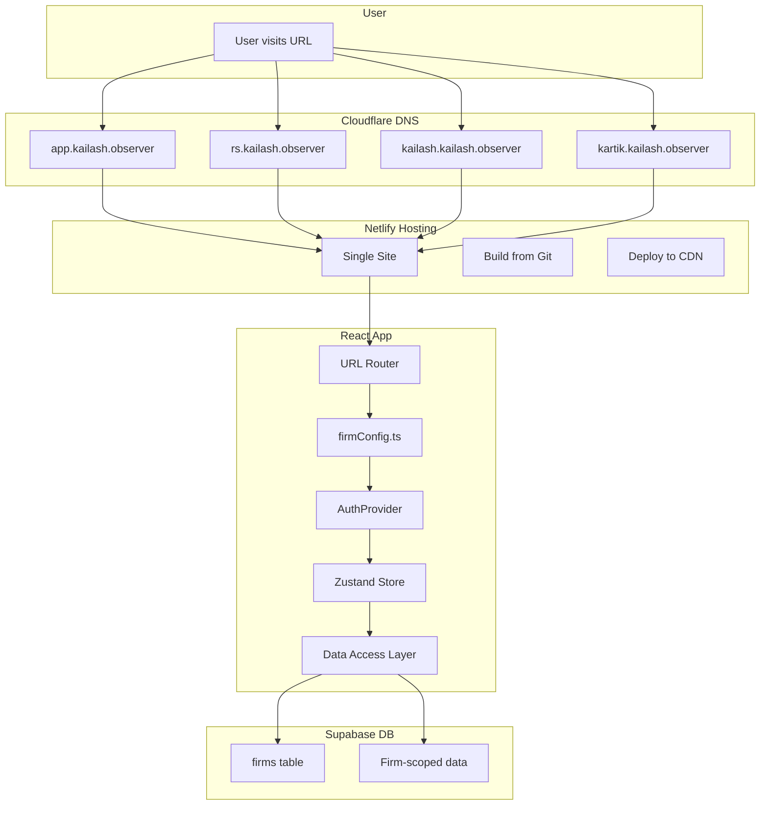
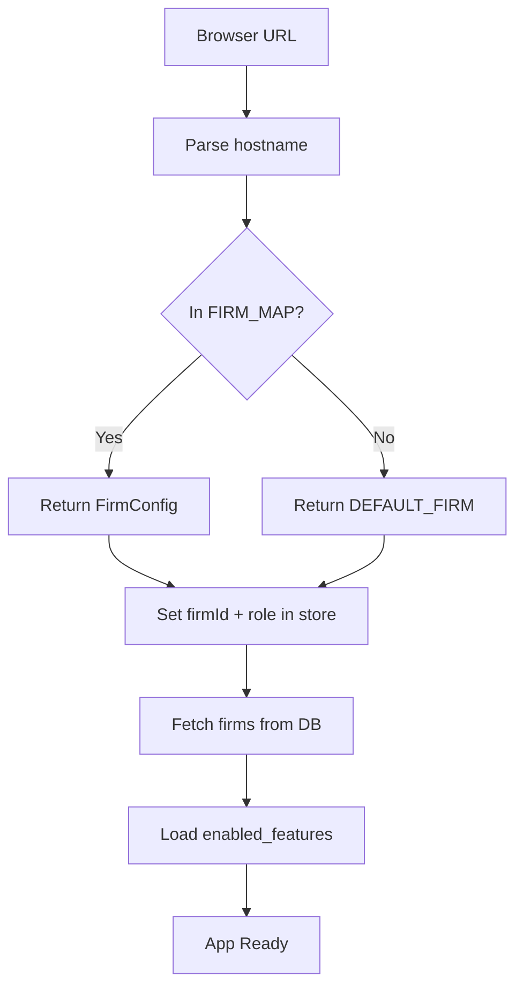
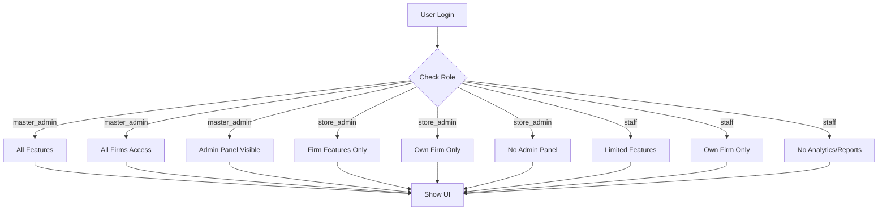
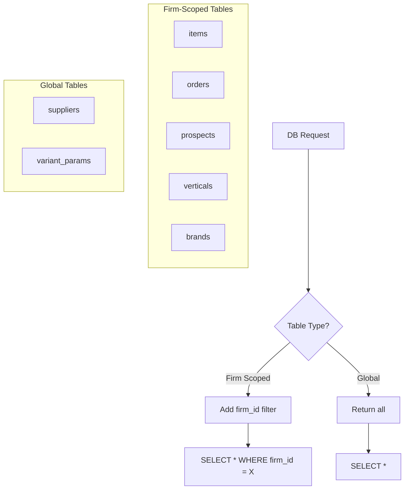

# Firm-Based App Architecture

## Overview

Single codebase, multiple firm instances via subdomain routing.

---

## System Flow (Vertical)



---

## URL → Firm Resolution



---

## Role-Based Access



---

## Data Isolation



---

## Firm Configuration

| Subdomain | Firm | UUID | Role |
|-----------|------|------|------|
| `app.kailash.observer` | Master HQ | `11111111-...` | master_admin |
| `rs.kailash.observer` | R.S. Enterprises | `33b0fa7a-...` | store_owner |
| `kailash.kailash.observer` | Kailash Fataka | `a41012cc-...` | store_owner |
| `kartik.kailash.observer` | Kartik Traders | `be17178e-...` | store_owner |

---

## Feature Matrix

| Feature | master_admin | store_admin | staff |
|---------|:------------:|:-----------:|:-----:|
| Admin Panel | ✅ | ❌ | ❌ |
| Firm Switcher | ✅ | ❌ | ❌ |
| Feature Toggle | ✅ | ❌ | ❌ |
| Analytics | ✅ | ✅ | ❌ |
| Reports | ✅ | ✅ | ❌ |
| Accounting | ✅ | ✅ | ❌ |
| Billing | ✅ | ✅ | ✅ |
| Inventory | ✅ | ✅ | ✅ |
| Suppliers | ✅ | ✅ | ✅ |
| Warehouse | ✅ | ✅ | ✅ |
| Field Ops | ✅ | ✅ | ❌ |
| Marketing | ✅ | ✅ | ❌ |
| Media | ✅ | ✅ | ❌ |

---

## Cloudflare DNS Setup

```
Type: CNAME
Name: app
Target: your-site.netlify.app
Proxy: ✅ Enabled

Type: CNAME  
Name: rs
Target: your-site.netlify.app
Proxy: ✅ Enabled

Type: CNAME
Name: kailash
Target: your-site.netlify.app
Proxy: ✅ Enabled

Type: CNAME
Name: kartik
Target: your-site.netlify.app
Proxy: ✅ Enabled
```

---

## Netlify Settings

```
Build Command: npm run build
Publish Directory: dist

# All subdomains point to same site
# App resolves firm from hostname
```

---

## Code Flow

```
App.tsx
  └── resolveFirmFromURL()     # Get firm from hostname
  └── AuthProvider             # Handle login/session
      └── LoginPage            # If not logged in
      └── FirmSwitcher         # If master_admin
      └── Routes
          └── FeatureRoute     # Check feature access
              └── Pages        # Render if allowed
```

---

## Quick Reference

### Default Credentials
| Username | Password | Role |
|----------|----------|------|
| admin | visualos2024 | master_admin |
| rs_admin | rs2024 | store_admin |
| kailash_admin | kailash2024 | store_admin |
| kartik_admin | kartik2024 | store_admin |
| staff | staff2024 | staff |

### Key Files
| File | Purpose |
|------|---------|
| `src/config/firmConfig.ts` | Subdomain → firm mapping |
| `src/config/featuresConfig.ts` | Feature definitions |
| `src/auth/AuthProvider.tsx` | Login/session handling |
| `src/hooks/useFeatureFlag.ts` | Feature access check |
| `src/db/dal.ts` | Firm-scoped DB queries |
