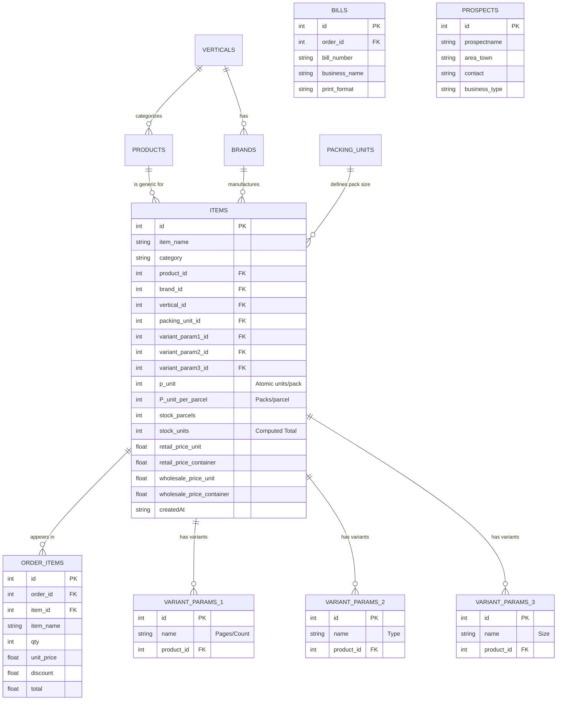
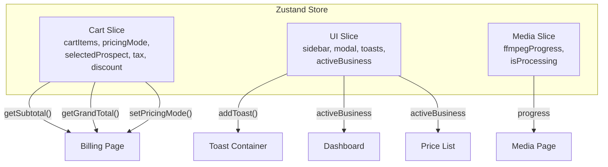

# VisualOS — Technical Documentation

## Architecture

```
```
src/
├── main.tsx              # App entry point (React + StrictMode)
├── App.tsx               # Router + Layout wrapper
├── index.css             # Global styles, glass tokens, animations
│
├── db/
│   └── dexie.ts          # Database schema (v7), interfaces, seeding
│
├── store/
│   └── store.ts          # Zustand global state (Cart + UI + Media slices)
│
├── pages/
│   ├── Dashboard.tsx     # KPI overview
│   ├── Inventory.tsx     # Item CRUD table (3-tier stock)
│   ├── Catalogue.tsx     # Catalogue Builder (Flipbook)
│   ├── Billing.tsx       # Cart + order creation
│   ├── PriceList.tsx     # PDF price list generator
│   ├── Accounting.tsx    # Revenue/cost tracking
│   ├── Prospects.tsx     # Customer CRM
│   ├── Routes.tsx        # Visit & travel logs
│   ├── Media.tsx         # Image gallery + GIF gen
│   └── Maintenance.tsx   # Backup/restore + Reference Data
│
├── components/
│   ├── billing/
│   │   ├── InvoiceA4.tsx     # A4 print layout
│   │   ├── InvoiceThermal.tsx# Thermal print layout
│   │   └── PrintHandler.tsx  # Print/share modal
│   ├── layout/
│   │   ├── Sidebar.tsx       # Navigation sidebar
│   │   ├── Header.tsx        # Top header bar
│   │   └── Layout.tsx        # Main layout wrapper
│   └── ui/
│       └── ToastContainer.tsx# Toast notification system
│
├── utils/
│   ├── share.ts          # Web Share API + download helpers
│   └── catalogueGenerator.ts # HTML Flipbook generator
│
├── workers/
│   └── ffmpeg.worker.ts  # GIF generation Web Worker
│
└── __tests__/
    ├── dexie.test.ts     # Database CRUD tests
    ├── billing.test.ts   # Billing logic tests
    └── pricelist.test.ts # Price list logic tests
```

---

## Tech Stack

| Layer | Technology |
|-------|-----------|
| Framework | React 18+ with TypeScript |
| Routing | React Router v6 |
| State | Zustand (single store, multiple slices) |
| Database | Dexie.js (IndexedDB wrapper) |
| Live Queries | dexie-react-hooks (`useLiveQuery`) |
| PDF | jsPDF |
| Printing | react-to-print |
| Icons | lucide-react |
| Image compression | browser-image-compression |
| Build | Vite |
| Testing | Vitest + fake-indexeddb |
| PWA | vite-plugin-pwa |

---

## Data Model (ER Diagram)

**Schema Version**: v7



---

## State Management Architecture



---

## Key Design Decisions

1. **No backend** — IndexedDB stores everything locally for offline-first usage
2. **4-tier pricing** — Retail/Wholesale × Piece/Pack covers all B2B and B2C scenarios
3. **Items vs Products** — `items` are individual SKUs; `products` are generic names for grouping
4. **Lightweight Inventory table** — Custom sort/filter/group instead of `@tanstack/react-table` to avoid browser freeze on large datasets
5. **Zustand slices** — Cart, UI, Media in one store for simple cross-component access
6. **Rs. currency** — `Rs.` used everywhere instead of `₹` for PDF-safe encoding
7. **Web Workers** — GIF generation runs in a worker to keep UI responsive

---

## Build & Run

```bash
# Install
npm install

# Dev server
npm run dev

# Build for production
npm run build

# Run tests
npx vitest run

# Type check
npx tsc --noEmit
```

---

## Database Seeding

On first run, the database auto-seeds:

| Table | Seed Data |
|-------|-----------|
| verticals | Stationery, Cutlery, Fireworks, FMCG |
| brands | Reegal, Prime, Supreme, Chouhan, Ashoka, Sunrise, Standard |
| products | Notebooks, Pens, Pencils, Sky Shot, Flower Pot, Spoons, Plates, Soap, Detergent |
| packing_units | piece (×1), dozen (×12), box of 5 (×5), bundle of 10 (×10), carton of 20 (×20) |
| business_config | R.S. Enterprises (active), Kartik Traders, Kailash Cutlery |
